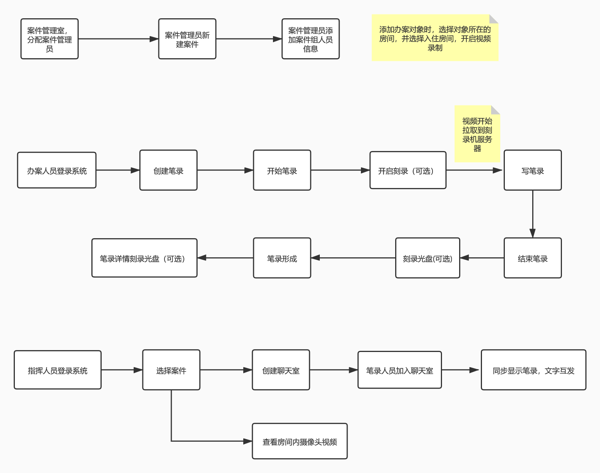

### 项目介绍

​	ncjw主要作用于办案人员的无纸化操作。

#### 项目要求

- **办案对象**：入住房间后，用户开启房间内的录像，房间内四个摄像头开始录制单画面视频，其次选择其中的枪机、球机、半球3个摄像头的画面合成为一个画面的视频存储在服务器
-  **案件人员**：用户录入案件组人员所有信息
-  **办案人员**：在平台中写笔录（类比word），与此同时可以在笔录做完后刻录的这段时间的合成视频到光盘中，光盘的表面有打印（案件名，笔录开始时间，结束时间，办案人员...) 等信息
-  **指挥人员** ：在办案人员做笔录时，可同步将笔录显示在自己的界面，并可与办案人员进行文字、语音的交流
-  **刻录**：针对笔录刻录，可以在做笔录时，一遍写一遍刻录（**实时刻录**）；也可在笔录做完后再进行这段时间的刻录（**事后刻录**）
- **加密**： 需对刻录的视频进行加密处理；分为密码加密，密钥加密，密码+密钥加密；达到刻录出的光盘打开视频时需输入正确的密码或密钥
- **视频下载**：对录制的视频下载到用户本地

### 项目模块

#### 基础管理

- **摄像头管理** --> 当地的所有摄像头的IP列表管理 --> 直播查看任一摄像头
- 房间管理     --> 当地所有的房间管理 --> 房间中包含哪几个摄像头

#### 案件管理

- 创建案件 --> 用户创建新案件
- **案件列表** --> 用户所有创建的案件
  - 添加案件组人员的信息（办案对象 办案人员 指挥人员 .....）（身份证 手机号.....）
  - (**主要**) 添加办案对象后 ，指定该对象要在哪间房间进行入住，开启房间视频录制
  - 办案对象离开房间后，退出房间（停止房间视频录制）

#### 电子笔录（主要）

- 创建笔录 
- 操作笔录 --> 开始笔录 --> 刻录 -->写笔录 --> 结束笔录 ---> 拿光盘

#### 案件指挥（主要)

- 查看房间摄像头视频
- 创建和笔录人员的聊天室
  - 同步显示笔录
  - 文字交流
  - 语音交流

#### 系统管理

- 添加新用户
- 用户权限修改

### 项目主要流程

